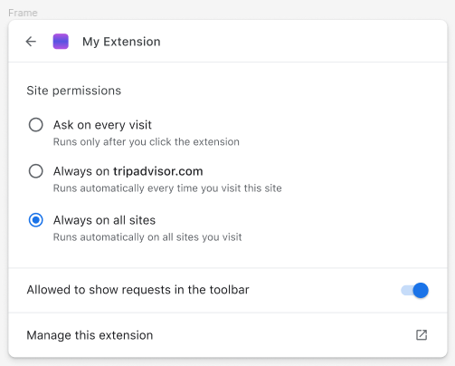

# permissions.[add/remove]SiteAccessRequest() API

## API Overview

### Background

Extensions can request host permissions via:
- Manifest declared `host_permissions`, granted at install time by default
- Manifest declared `optional_host_permissions`, granted at runtime after a user gesture by `<browser>.permissions.request()`
- Manifest declared `matches` for a `content_script`, granted at install time by default

In some browsers, users can withhold host permissions causing the extension to only have site access when the extension is invoked. For example, in Chrome a user can set an extension to run only "on click". When the extension is clicked, it gains site access to the tab's main frame origin (effectively acting like [`activeTab` permission](https://developer.chrome.com/docs/extensions/develop/concepts/activeTab#what-activeTab-allows).

Each browser may decide how it signals the user when an extension is requesting access (e.g through the extensions menu). However, there is no way for an extension to explicitly signal at runtime it’s requesting site access after it was withheld without a user gesture and a heavy-weight permission dialog.


### Objective

Allow the extension to show site access requests at runtime without any user gesture in a less-obtrusive way than with `permissions.request()`. This can be done with a new API that:

- Applies to a specific tab or document id
- Doesn’t need to be made inside the handler for a user action
- Shows the request in the UI, handled differently by each browser. See more in [UI Elements and User-Visible Effects](#ui-elements-and-user-visible\-effects) section
- When accepted, grants always access to the site’s top origin
- Resets the request on cross-origin navigation

#### Use Cases

An extension requested access to a site but the user withheld its access and forgot about it. Extension wants to signal it needs site access to execute without user action. For example, “shopping” extension wants to show site access when user navigates to “amazon.com” and access was withheld.

### Consumers

Extensions that want to signal the user when they need site access.

## Implementation

### API Schema

```
// Adds a site access request. Request will only be signaled to the user if
// extension can be granted access to site in the request (i.e., one specified
// in host_permissions, optional_host_permissions, a content script match
// pattern, or an applicable activeTab site).
// Resolves whether the request is valid.
Promise<bool> <browser>.permissions.addSiteAccessRequest(
  // The id of the tab where site access requests can be shown. If provided,
  // the request is shown on the specified tab and is removed when the tab
  // navigates to a new origin.
  // Chrome requires either this or `documentId` to be specified.
  number?: tabId,
  // The id of a document where site access requests can be shown.  Must be
  // the top-level document within a tab.  If provided, the request is shown on
  // the tab of the specified document and is removed when the document
  // navigates to a new origin.
  // Chrome requires either this or `tabId` to be specified.
  string?: documentId,
  // The URL pattern where site access requests can be shown. If provided,
  // site access requests will only be shown on URLs that match this pattern.
  // Browsers may require different levels of specificity.
  string?: url
  callback?: function,
);

// Removes a site access request, if existent.
// Resolves whther the request was removed.
Promise<bool> <browser>.permissions.removeSiteAccessRequest(
  // The id of the tab where site access request will be removed.
  // Chrome requires either this or `documentId` to be specified.
  number?: tabId,
  // The id of a document where site access request will be removed.
  // Chrome requires either this or `tabId` to be specified.
  string?: documentId,
  // The URL pattern where site access request will be removed.
  string?: url
  callback?: function,
);
```

Note: We don’t support iframes since they are not included in the runtime host permissions UI.

### New Permissions
| Permission Added | Proposed Warning                                         |
| ---------------- | -------------------------------------------------------- |
| N/A              | Permission’s API is used to “request declared optional permissions at run time rather than install time, so users understand why the permissions are needed and grant only those that are necessary” (according to documentation). The goal of this new method is for the extension to request site access, which is effectively a permission. We can adjust the  description to not be restricted just to optional permissions. |

#### Other Alternatives considered

- Action API is used to control the extension’s button in the browser’s toolbar. It’s exposed if the extension includes the "action" key in the manifest. This is troublesome since an extension could not have an action, but still want to show site access requests. We should not limit requests for extensions with actions
- `permissions.addSiteAccessRequest()` resolves when request is accepted/rejected. An extension could be requesting site access and be granted site access through another mechanism (e.g changing site access in the extensions menu). We would either return a) true if we consider permissions granted through other mechanisms or b) false, because permission wasn't explicitely granted through the request. a) adds complexity and b) may cause confusion. Thus, we consider better to resolve whether the request is valid, and separately extension can listen whether permission is granted through `permissions.onAdded()`.

### Manifest Changes

None.

### Custom Bindings

None.

### Design and Implementation

#### Persistence

Showing a site access request is never persisted.

#### Alignment with Other Vendors and Action APIs

Each browser can decide how they want to signal the extension site access requests. Browsers may decide to ignore the request (e.g due to noisiness, or if an extension has no visible UI).
On Chrome’s side, we are exploring adding an ‘Allow’ chip in the extensions toolbar.

## User Experience

### UI Elements and User Visible-Effects

Each browser will handle the request as desired. On Chrome’s side, we are considering showing an ‘Allow’ button in the toolbar for these requests. On click, it would grant persistent access to the site’s origin (which can be again withheld by the user)


We would also provide a way for users to silence the requests for an extension through a setting in the extensions menu and in chrome://extensions.



#### Attribution
The site access request will be attributed directly to the extension.

## Security and Privacy

### Exposed Sensitive Data

This API does not directly expose any sensitive data to the extension. However, it could lead to the extension gaining access to the site.

### Abuse Scenarios

Extensions can enable site access requests on every tab, which could be annoying to the user.

#### Mitigations
Attacks of annoyance are not in our threat model. Extensions can have annoying behaviors, but they risk uninstallation.
On the browser side, we can place some restrictions to limit noisiness:
- User can decide whether they want to see site access requests for an specific extension
- We can explore setting a max amount of times the request is shown when the user ignores it.

### Additional Security Considerations
None

## Alternatives

### Existing Workarounds

Users can change an extension's site access. The only way for extensions to signal the user they want to regain access to the site is through `permissions.request()` flow which is noisy and requires a user gesture. Otherwise, they rely on the user realizing through the browser UI (e.g extensions menu).

Extensions have no way to signal the user that they want access to the site, and rely on the user realizing through the browser UI (e.g extensions menu)

### Other Alternatives Considered

Specifying URL patterns instead of tabId or documentId in `permissions.addSiteAccessRequest` or in the extension's manifest. We decided against that because:
- This is designed to be a highly-contextual signal. The extension should do it only if they have strong believe they will provide value to the user on the given page. This should not be a passive, "hey, I think I can do something here", it should be a "hey, you, the user, probably want me to do something here".
- We do not want extensions to simply show a request on every page, and specifying a list of patterns would lend itself to that behavior (even by not allowing broad match patterns).
- It's too close to host permissions themselves. We suspect that the vast majority of extensions would just have the same field match as in their host permissions, since there is no more knowledge at manifest time about why the extension would run on a specific site.

### Open Web API
This is related to the extensions showing site access requests in the browser; it doesn't affect the web.
